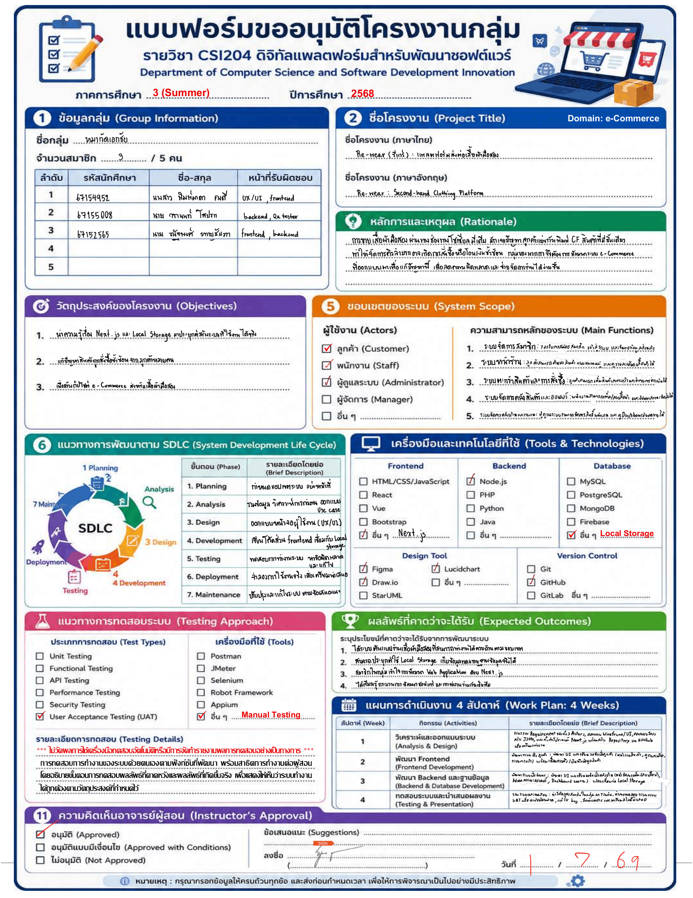

<div align="center">
  <h1>Re-wear Collective</h1>
  <p>
    <strong>แพลตฟอร์ม e-Commerce สำหรับส่งต่อเสื้อผ้ามือสอง (Circular Fashion)</strong>
    <br />
    <i>"เพราะแฟชั่นไม่จำเป็นต้องทำร้ายโลก"</i>
  </p>
</div>

<div align="center">
  
  
  
  
</div>

<br />

> โครงการนี้จัดทำขึ้นเพื่อประกอบการเรียนวิชา **CSI204 ดิจิทัลแพลตฟอร์มสำหรับพัฒนาซอฟต์แวร์** โดยเป็นแพลตฟอร์ม e-Commerce แบบครบวงจรที่มีเป้าหมายเพื่อลดขยะแฟชั่น สร้างคอมมูนิตี้สำหรับผู้ที่รักสิ่งแวดล้อม และอำนวยความสะดวกในการซื้อขาย

---

## สารบัญ (Table of Contents)

- [ฟีเจอร์หลัก](#ฟีเจอร์หลัก-key-features)
- [เทคโนโลยีที่ใช้](#เทคโนโลยีที่ใช้-tech-stack)
- [คู่มือการติดตั้งและใช้งาน](#คู่มือการติดตั้งและใช้งาน-getting-started)
- [บัญชีสำหรับทดสอบ](#บัญชีสำหรับทดสอบ-demo-accounts)
- [ผลการทดสอบระบบ (UAT)](#ผลการทดสอบระบบ-uat)
- [โครงสร้างโปรเจกต์](#โครงสร้างโปรเจกต์-project-structure)
- [ลิงก์ที่เกี่ยวข้อง](#ลิงก์ที่เกี่ยวข้อง-resources)

---

## ฟีเจอร์หลัก (Key Features)

ระบบได้ถูกออกแบบแยกตามขอบเขตของผู้ใช้งาน **3 กลุ่ม** อย่างชัดเจน:

### ลูกค้า (Customer)
| ฟีเจอร์ | รายละเอียด |
|---|---|
| Shopping Experience | ค้นหาและกรองสินค้า, ระบบตะกร้า, สั่งซื้อและชำระเงินจำลอง |
| Order Management | ประวัติคำสั่งซื้อ, ติดตามสถานะ |
| Eco-Impact Dashboard | สรุปสถิติรักษ์โลกส่วนบุคคล (คำนวณจากยอดสั่งซื้อ) |
| Wardrobe / Favorites | ระบบตู้เสื้อผ้า บันทึกสินค้าที่ชื่นชอบ |
| Missions & Rewards | ภารกิจรายวัน สะสมแต้ม แลกรางวัล |

### พนักงาน (Staff)
| ฟีเจอร์ | รายละเอียด |
|---|---|
| Inventory | จัดการคลังสินค้า, เพิ่ม/แก้ไข/อัปเดตสถานะ |
| Order Fulfillment | อัปเดตสถานะคำสั่งซื้อ (สะท้อนถึงลูกค้าทันที) |
| Promotions | จัดการโปรโมชันและโค้ดส่วนลด |

### ผู้ดูแลระบบ (Admin)
| ฟีเจอร์ | รายละเอียด |
|---|---|
| Dashboard | แผงควบคุมสรุปยอดขาย, กราฟรายได้, Activity Log |
| User Management | จัดการสิทธิ์ผู้ใช้งาน (Customer ↔ Staff) |
| Lookbooks | จัดการชุดแฟชั่นโปรโมตที่หน้าแรก |
| Settings | ตั้งค่าร้านค้า (ค่าส่ง, ชื่อร้าน, Eco-Rate) |

> **Security Highlight:** ระบบมี **Role-based Route Protection** เพื่อป้องกันการเข้าถึงหน้า Admin โดยตรงจากผู้ที่ไม่มีสิทธิ์ และ **Notification System** เพื่อเก็บประวัติการกระทำของ Admin และ Staff

---

## เทคโนโลยีที่ใช้ (Tech Stack)

| หมวดหมู่ | เทคโนโลยีที่เลือกใช้ |
|---|---|
| **Frontend Framework** | **Next.js 15** (App Router + React) |
| **Styling & UI** | Tailwind CSS v3 (Earth Tone Style), Lucide React |
| **Data Visualization** | Recharts (สำหรับกราฟ Dashboard) |
| **State Management** | React Context API (Auth, Cart, Settings) |
| **Database (Mock)** | Local JSON + API Routes (`fs.promises` อ่าน/เขียนไฟล์จริง) |
| **Tools & Design** | Git, GitHub, Figma, Draw.io |

---

## คู่มือการติดตั้งและใช้งาน (Getting Started)

คุณสามารถนำโปรเจกต์นี้ไปรันในเครื่องส่วนตัวได้ด้วยขั้นตอนดังนี้:

**1. ติดตั้ง Dependencies**
```bash
npm install
```

**2. รัน Development Server**
```bash
npm run dev
```

**3. เปิดใช้งาน**

เปิดเบราว์เซอร์แล้วไปที่ → `http://localhost:3000`

---

## บัญชีสำหรับทดสอบ (Demo Accounts)

ข้อมูลทั้งหมดถูกจำลองเก็บในโฟลเดอร์ `data/*.json` ระบบมีบัญชีตั้งต้นสำหรับการทดสอบ Role-based Login:

| บทบาท | อีเมล | รหัสผ่าน | สิทธิ์การเข้าถึง |
|:---:|---|:---:|---|
| **Admin** | `admin@rewear.com` | `admin` | เข้าถึงได้ **ทุกเมนู** รวมไปถึง Dashboard และ Users |
| **Staff** | `pipe@rewear.com` | `waranon777` | Inventory, Orders, Promotions (บล็อกหน้า Dashboard) |
| **Customer** | *สมัครใหม่ผ่านหน้าเว็บ* | — | ร้านค้า, ตะกร้า, การสั่งซื้อ, Eco-Impact, Wardrobe |

---

## ผลการทดสอบระบบ (UAT)

### สรุปผลการทดสอบ

<div align="center">

| Persona | Pass | Fail | Total |
|:---:|:---:|:---:|:---:|
| Customer | **9** | 0 | 9 |
| Staff | **6** | 0 | 6 |
| Admin | **6** | 0 | 6 |
| **Total** | **21** | **0** | **21** |

**Pass Rate: 100%**

</div>

ระบบทำงานได้อย่างถูกต้องสมบูรณ์ในทุกฟังก์ชันหลัก ไม่พบข้อบกพร่อง (Defect) จากกรณีทดสอบทั้งหมด

### Issues Log
> ไม่พบปัญหาจากการทดสอบ (No issues found)

### Go-Live Evaluation
> ระบบผ่านการทดสอบครบทั้ง **21 กรณี** (อัตราการผ่าน **100%**) ฟังก์ชันหลักทั้งหมดทำงานได้ตามความต้องการ จึง **พร้อมสำหรับการส่งมอบและเปิดใช้งานจริง (Ready for Go-Live)**

---

### รายละเอียดการทดสอบตามกลุ่มผู้ใช้งาน

ระบบผ่านการทดสอบแบบ Manual Testing ในทุกฟีเจอร์หลัก โดยแบ่งตามกลุ่มผู้ใช้งานดังนี้:

<details>
<summary><b>Customer — 9 Test Cases (คลิกเพื่อดูรายละเอียด)</b></summary>
<br>

| รหัส | หมวดหมู่ | การทดสอบ (Test Case) | สถานะ |
|:---:|---|---|:---:|
| C01 | Authentication | สมัครสมาชิกใหม่, ล็อกอิน, ล็อกเอาต์ และจำ Session ได้ | Pass |
| C02 | Shopping | ค้นหาสินค้าจากคีย์เวิร์ด, กรองหมวดหมู่, ดูรายละเอียดสินค้า | Pass |
| C03 | Checkout | หยิบใส่ตะกร้า, จัดการจำนวน, ส่งคำสั่งซื้อ | Pass |
| C04 | Orders | ตรวจสอบสถานะและประวัติคำสั่งซื้อทั้งหมด | Pass |
| C05 | Reviews | เขียนรีวิวสำหรับสินค้าที่จัดส่งสำเร็จ (Delivered) | Pass |
| C06 | Wardrobe | บันทึกหรือลบสินค้าที่ชื่นชอบในรายการตู้เสื้อผ้าส่วนตัว | Pass |
| C07 | Eco-Impact | แดชบอร์ดสรุปสถิติรักษ์โลก (คำนวณจากยอดสั่งซื้อ) | Pass |
| C08 | Missions | ทำภารกิจรายวันและสะสมแต้มอัตโนมัติเมื่อสั่งซื้อถึงเกณฑ์ | Pass |
| C09 | Profile | แก้ไขข้อมูล, รหัสผ่าน, รูปโปรไฟล์ (อัปเดตแบบ Real-time) | Pass |

</details>

<details>
<summary><b>Staff — 6 Test Cases (คลิกเพื่อดูรายละเอียด)</b></summary>
<br>

| รหัส | หมวดหมู่ | การทดสอบ (Test Case) | สถานะ |
|:---:|---|---|:---:|
| S01 | Role Guard | ล็อกอินแล้วถูกบล็อกเมื่อพยายามเข้า URL ของ Admin โดยตรง | Pass |
| S02 | Inventory | เพิ่มหรือแก้ไขข้อมูลสินค้า (บังคับราคามากกว่า 0), เปลี่ยนรูปภาพ | Pass |
| S03 | Inventory | เปลี่ยนสถานะสินค้า (Draft, Available, Sold Out, Reserved) | Pass |
| S04 | Orders | ดูรายการสั่งซื้อและปรับสถานะออเดอร์ (อัปเดตถึงฝั่งลูกค้าทันที) | Pass |
| S05 | Promotions | สร้าง แก้ไข ปิดเปิดโค้ดส่วนลด และนำไปใช้จริงในหน้า Checkout | Pass |
| S06 | Profile | อัปเดตข้อมูลพนักงาน (สะท้อนผลทั่วระบบทันที) | Pass |

</details>

<details>
<summary><b>Admin — 6 Test Cases (คลิกเพื่อดูรายละเอียด)</b></summary>
<br>

| รหัส | หมวดหมู่ | การทดสอบ (Test Case) | สถานะ |
|:---:|---|---|:---:|
| A01 | Authentication | ล็อกอินและเข้าถึง Dashboard ได้ครบถ้วน | Pass |
| A02 | Staff Rights | ทบทวนสิทธิ์ของ Staff ทั้งหมด (Admin ทำได้ทุกอย่างที่ Staff ทำได้) | Pass |
| A03 | Dashboard | ดึงสถิติยอดขาย กราฟรายได้ และ Activity Log มาแสดงผลได้จริง | Pass |
| A04 | Users | จัดการรายชื่อผู้ใช้ และสามารถปรับเปลี่ยน Role (Customer ↔ Staff) ได้ | Pass |
| A05 | Lookbooks | สร้างหรือแก้ไขชุดแฟชั่นโปรโมตที่หน้าแรก | Pass |
| A06 | Settings | บันทึกตั้งค่าร้านค้า (เพดานค่าส่ง, ชื่อร้าน, Eco-Rate) ไปใช้จริง | Pass |

</details>

---

## โครงสร้างโปรเจกต์ (Project Structure)

<details>
<summary><b>คลิกเพื่อดูโครงสร้าง Folders หลัก</b></summary>
<br>

```text
re-wear/
├── data/                    # ฐานข้อมูลจำลอง (JSON Files)
│   ├── lookbooks.json       # ข้อมูลแฟชั่น Lookbooks หน้าแรก
│   ├── metadata.json        # ข้อมูลหมวดหมู่, ไซส์, แบรนด์อ้างอิง
│   ├── orders.json          # ข้อมูลประวัติคำสั่งซื้อ
│   ├── products.json        # คลังสินค้าทั้งหมด
│   ├── settings.json        # ตั้งค่าร้านค้าส่วนกลาง
│   └── users.json           # ข้อมูลบัญชีผู้ใช้และสิทธิ์การใช้งาน
├── docs/                    # เอกสารวิเคราะห์ระบบ (Analysis & Design)
├── public/                  # ไฟล์ Static Assets
└── src/
    ├── app/                 # ระบบ Routing ของเว็บ (Next.js App Router)
    │   ├── admin/           # ระบบหลังบ้าน (Dashboard, Inventory, Orders, Users, Settings)
    │   ├── api/             # Backend API Routes (รองรับการดึงและเขียนข้อมูล JSON)
    │   ├── eco-impact/      # หน้าสรุปผลกระทบต่อสิ่งแวดล้อม (Eco-Impact)
    │   ├── orders/          # หน้าเช็คสถานะและประวัติคำสั่งซื้อของลูกค้า
    │   ├── product/         # หน้ารายละเอียดสินค้าแต่ละชิ้น
    │   ├── profile/         # หน้าจัดการบัญชีผู้ใช้และรหัสผ่าน
    │   ├── search/          # หน้าค้นหาและกรองสินค้าตามหมวดหมู่
    │   ├── wardrobe/        # ตู้เสื้อผ้าจำลอง (รายการสินค้าที่ชอบ)
    │   ├── layout.jsx       # Layout หลักของเว็บไซต์ (โครงสร้างหน้า)
    │   └── page.jsx         # หน้า Landing Page (Home)
    ├── assets/              # ไฟล์รูปภาพ (Images) สำหรับโครงสร้างระบบ
    ├── components/          # UI Components ที่แยกย่อยเพื่อให้ใช้ซ้ำได้
    │   ├── admin/           # UI Components เฉพาะระบบหลังบ้าน
    │   ├── home/            # UI Components สำหรับหน้าแรก (Hero, Lookbook)
    │   ├── ui/              # UI Components พื้นฐาน (ปุ่ม, ฟอร์ม, Toast)
    │   └── Navbar, Footer   # Components หลัก
    ├── context/             # React Context สำหรับเก็บ Global State
    │   ├── AuthContext.jsx  # ระบบ Authentication และจัดการผู้ใช้ปัจจุบัน
    │   ├── CartContext.jsx  # ระบบตะกร้าสินค้า (เชื่อมฐานข้อมูล/Local Storage)
    │   ├── FavoritesContext.jsx # ระบบรายการโปรด/ตู้เสื้อผ้า
    │   └── SettingsContext.jsx  # การตั้งค่าร้านค้าที่ดึงจากหลังบ้านมาใช้
    ├── hooks/               # Custom Hooks
    │   ├── useAdminGuard.js # Middleware ป้องกันการเข้าหลังบ้านโดยไม่มีสิทธิ์
    │   └── useRoleGuard.js  # Middleware แยกสิทธิ์อื่นๆ
    ├── lib/                 # ฟังก์ชัน Utility หลัก
    │   └── db.js            # ระบบจัดการ Database เสมือน (อ่าน/เขียนไฟล์ JSON)
    ├── styles/              # สไตล์ CSS และ Tailwind CSS Configuration
    └── utils/               # ฟังก์ชันตัวช่วยจัดการ LocalStorage
```

</details>

---

## ลิงก์ที่เกี่ยวข้อง (Resources)

| ลิงก์ | คำอธิบาย |
|---|---|
| [Re-wear GitHub Pages](https://waranon-sop.github.io/csi204-project/) | เว็บไซต์ที่ Deploy แล้ว |
| [GitHub Repository](https://github.com/waranon-sop/csi204-project) | Source Code |
| [Figma Design](https://www.figma.com/design/1K2hJcSxbNVsy1EvjIkmAZ/Re-wear?node-id=0-1&p=f&t=ZE52yZWB8HONY6yu-0) | UI/UX Design |
| [Analysis & Design](docs/analysis-design.md) | เอกสารวิเคราะห์ระบบ |

<br>

**เอกสารขออนุมัติโครงงาน:**

<div align="center">
  
</div>
