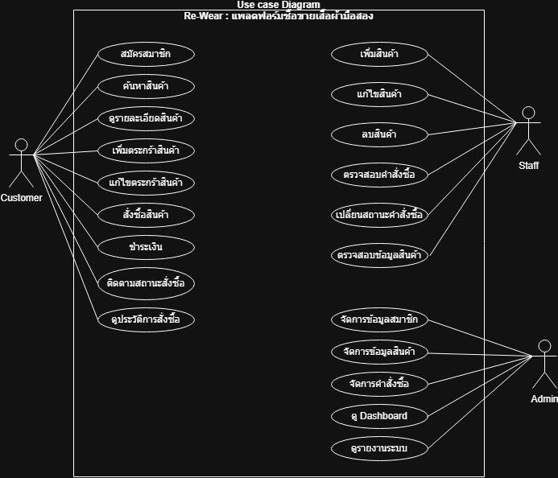
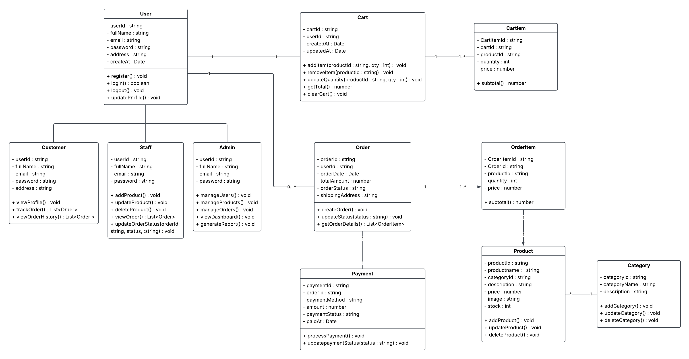
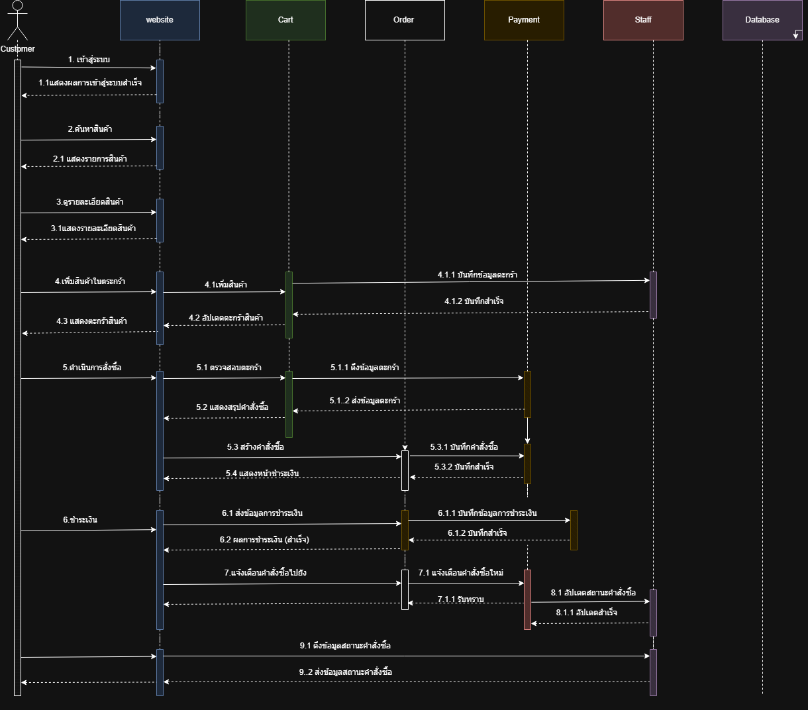

# เอกสาร Analysis & Design — Re-wear

## สารบัญ

- [1. ภาพรวมระบบ (System Overview)](#1-ภาพรวมระบบ-system-overview)
- [2. ความต้องการของระบบ (Requirement Analysis)](#2-ความต้องการของระบบ-requirement-analysis)
  - [2.1 Functional Requirements](#21-functional-requirements)
  - [2.2 Non-Functional Requirements (SLA Targets)](#22-non-functional-requirements-sla-targets)
  - [2.3 Use Case Diagram](#23-use-case-diagram)
- [3. การจำลองกลุ่มผู้ใช้งาน (Persona Design)](#3-การจำลองกลุ่มผู้ใช้งาน-persona-design)
- [4. สถาปัตยกรรมระบบ (System Architecture)](#4-สถาปัตยกรรมระบบ-system-architecture)
- [5. โครงสร้างฐานข้อมูล (Database Design)](#5-โครงสร้างฐานข้อมูล-database-design)
  - [5.1 Data Schema (Local JSON Database)](#51-data-schema-local-json-database)
  - [5.2 Class Diagram](#52-class-diagram)
- [6. Flow การทำงานหลัก (Sequence)](#6-flow-การทำงานหลัก-sequence)
  - [6.1 Sequence Diagram](#61-sequence-diagram)
- [7. หลักการออกแบบที่นำมาใช้ (Design Principles)](#7-หลักการออกแบบที่นำมาใช้-design-principles)
- [8. สรุป (Conclusion)](#8-สรุป-conclusion)

---

## 1. ภาพรวมระบบ (System Overview)

ระบบ Re-wear เป็นแพลตฟอร์ม e-Commerce สำหรับซื้อขายเสื้อผ้ามือสอง ออกแบบมาสำหรับผู้ใช้งาน 3 กลุ่ม ได้แก่ ลูกค้า (Customer), พนักงาน (Staff) และผู้ดูแลระบบ (Admin) โดยแต่ละกลุ่มมีสิทธิ์การเข้าถึงและฟังก์ชันการใช้งานที่แตกต่างกัน

---

## 2. ความต้องการของระบบ (Requirement Analysis)

### 2.1 Functional Requirements

| รหัส | รายการ | รายละเอียด | ความสำคัญ |
|---|---|---|---|
| F-01 | สมัครสมาชิก | ลูกค้าสามารถสมัครสมาชิกเพื่อเข้าใช้งาน | High |
| F-02 | ค้นหาและดูสินค้า | ลูกค้าสามารถค้นหาและดูรายละเอียดเสื้อผ้า | High |
| F-03 | จัดการตะกร้าสินค้า | ลูกค้าสามารถเพิ่ม แก้ไข ลบสินค้าในตะกร้า | High |
| F-04 | สั่งซื้อและชำระเงิน | ลูกค้าสามารถสั่งซื้อ ติดตามสถานะ และดูประวัติ | High |
| F-05 | จัดการสต็อกสินค้า | พนักงานสามารถเพิ่ม แก้ไข ลบ และตรวจสอบสินค้า | High |
| F-06 | จัดการคำสั่งซื้อ | พนักงานสามารถตรวจสอบและเปลี่ยนสถานะคำสั่งซื้อ | High |
| F-07 | Dashboard ผู้ดูแล | ผู้ดูแลระบบสามารถดูภาพรวมและรายงานระบบ | Medium |
| F-08 | จัดการผู้ใช้งาน | ผู้ดูแลระบบสามารถจัดการข้อมูลสมาชิกและสิทธิ์พนักงาน พร้อมแยกรหัส (ADM/STF/USR) | High |
| F-09 | Eco Impact Tracking | ระบบแสดงผลการลดการใช้น้ำ, CO2, และขยะ สำหรับลูกค้าและแอดมิน | Medium |
| F-10 | ระบบสะสมแต้ม (Rewards) | Widget สำหรับลูกค้าสะสมแต้มและรับส่วนลด (Gamification) | Low |

### 2.2 Non-Functional Requirements (SLA Targets)

- **Availability**: ความพร้อมใช้งานระบบ 99.5%
- **Backup**: สำรองข้อมูลผ่านไฟล์ JSON บนเซิร์ฟเวอร์
- **Support Hours**: จันทร์ - ศุกร์ เวลา 08:30 - 17:30 น.
- **Incident Response**: การตอบสนองและแก้ไขปัญหาตามระดับ Severity (1-3)

### 2.3 Use Case Diagram



---

## 3. การจำลองกลุ่มผู้ใช้งาน (Persona Design)

### 3.1 Persona 1: Customer (ลูกค้า)

- **ชื่อ:** ฟ้าใส สายรักษ์โลก (อายุ 22 ปี, นักศึกษา)
- **Bio:** ชื่นชอบแฟชั่นวินเทจและใส่ใจสิ่งแวดล้อม ซื้อเสื้อผ้ามือสองเพราะราคาถูกและมีสไตล์ไม่ซ้ำใคร
- **Goals:** หาเสื้อผ้ามือสองสภาพดีได้ง่าย ขั้นตอนสั่งซื้อไม่ซับซ้อน ติดตามสถานะของได้
- **Pain Points:** รายละเอียดสินค้าจากร้านทั่วไปไม่ชัดเจน ขั้นตอนสั่งซื้อยุ่งยาก


### 3.2 Persona 2: Staff (พนักงาน)

- **ชื่อ:** ก้องเกียรติ ขยันทำงาน (อายุ 26 ปี, พนักงานดูแลร้าน)
- **Bio:** รับหน้าที่จัดการออเดอร์ อัปเดตสต็อก และดูแลความเรียบร้อยของสินค้าในระบบ
- **Goals:** อัปเดตสถานะสินค้าและคำสั่งซื้อได้รวดเร็ว ตรวจสอบการชำระเงินได้ง่าย
- **Pain Points:** ระบบที่มีหลายขั้นตอนทำให้การจัดการออเดอร์ล่าช้า

### 3.3 Persona 3: Administrator (ผู้ดูแลระบบ)

- **ชื่อ:** วีระ ผู้จัดการ (อายุ 34 ปี, ผู้ดูแลระบบ)
- **Bio:** ดูแลภาพรวมการทำงานของระบบและบริหารสิทธิ์พนักงาน
- **Goals:** ดูสถิติและภาพรวมระบบผ่าน Dashboard จัดการสิทธิ์การเข้าถึงของพนักงาน
- **Pain Points:** ขาดเครื่องมือสรุปข้อมูลที่ดูง่ายในที่เดียว


---

## 4. สถาปัตยกรรมระบบ (System Architecture)

ระบบแบ่งออกเป็น 3 ส่วนหลัก ได้แก่ Frontend (Next.js), Backend (Next.js API Routes) และฐานข้อมูลจำลอง (JSON Files แยกตามหมวดหมู่ในโฟลเดอร์ `data/`)

<div align="center">
  
</div>

### 4.1 Frontend Architecture

- **การแสดงผล**: เว็บแอปพลิเคชันรองรับการทำงานของ Customer, Staff และ Admin บนอุปกรณ์ที่หลากหลาย
- **ฟังก์ชันหลัก**: ระบบสมัครสมาชิก / Login, แสดงสินค้า, จัดการตะกร้าสินค้า, ดำเนินการสั่งซื้อ และหน้า Dashboard จัดการระบบ
- **รูปแบบสถาปัตยกรรม**: Component-Based Architecture (SPA)
- **เทคโนโลยีหลัก**: Next.js 15 (React Framework)
- **ข้อพิจารณา**:
  - *UX/UI*: รองรับ Responsive Design เนื่องจากผู้ใช้ส่วนใหญ่เข้าผ่านโทรศัพท์มือถือ
  - *Security*: จำกัดการเข้าถึงหน้าต่างๆ ตามบทบาทผู้ใช้ (Role-based Access Control)
  - *Scalability*: วางโครงสร้าง Component ให้นำกลับมาใช้ซ้ำได้ง่าย

### 4.2 Backend Architecture

- **การจัดการ Business Logic**: CRUD ผ่าน API Routes สำหรับ Users, Products, Orders, Promotions และ Settings
- **ฟังก์ชันหลัก**: จัดการบัญชีผู้ใช้, สินค้าและสต็อก, คำสั่งซื้อ และระบบแจ้งเตือน
- **รูปแบบสถาปัตยกรรม**: Next.js API Routes (Route Handlers) ทำงานในรูปแบบ Serverless Functions
- **เทคโนโลยีหลัก**: Next.js App Router API
- **ข้อพิจารณา**:
  - *API Design*: ออกแบบตาม REST API รับส่งข้อมูลในรูปแบบ JSON
  - *Version Control*: ควบคุมเวอร์ชันและทำงานร่วมกันผ่าน Git / GitHub

### 4.3 Database Architecture

- **การจัดการข้อมูล**: แยกไฟล์ตามหมวดหมู่ข้อมูล เช่น `users.json`, `products.json`, `orders.json` เป็นต้น
- **รูปแบบสถาปัตยกรรม**: จำลองฐานข้อมูลด้วย JSON Files (`data/*.json`) โดยใช้ `fs.promises` ของ Node.js ในการอ่านเขียนแบบ Async เพื่อป้องกันปัญหาคอขวด (Blocking I/O)
- **เทคโนโลยีหลัก**: JSON File (วางแผนย้ายไปใช้ Relational หรือ NoSQL Database ในอนาคต)
- **ข้อพิจารณา**:
  - *Modularity*: แยกไฟล์ฐานข้อมูลตามหน้าที่ทำให้ดูแลรักษาง่าย และ API ออกแบบให้พร้อมรองรับฐานข้อมูลจริงได้ทันที

---

## 5. โครงสร้างฐานข้อมูล (Database Design)

### 5.1 Data Schema (Local JSON Database)

ข้อมูลถูกแยกเก็บตามไฟล์ในโฟลเดอร์ `data/` โดยแต่ละไฟล์ทำหน้าที่เหมือนตารางในฐานข้อมูล ตัวอย่างโครงสร้างมีดังนี้:

```json
{
  "users": [
    { "id": "USR-1024", "role": "customer", "name": "ฟ้าใส", "email": "fah@email.com" },
    { "id": "STF-0001", "role": "staff", "name": "สมหญิง", "email": "staff@rewear.com" },
    { "id": "ADM-0001", "role": "admin", "name": "ยิ่งยศ", "email": "admin@rewear.com" }
  ],
  "products": [
    { "id": "RW-29402", "name": "Vintage Linen Overcoat", "price": 145, "stock": 24, "condition": "Very Good", "status": "Available" }
  ],
  "orders": [
    { "id": "#RW-92031", "customer": "Sarah Jenkins", "total": 185, "status": "Pending", "trackingNumber": "" }
  ],
  "promotions": [
    { "id": "PROMO-001", "code": "WELCOME10", "type": "percentage", "value": 10, "status": "Active" }
  ],
  "storeSettings": {
    "storeName": "Re-Wear Store",
    "ecoWater": 2700,
    "ecoCO2": 6.5
  },
  "notifications": [
    { "id": 1698765432109, "user": "ยิ่งยศ", "action": "Added a new product", "type": "product" }
  ]
}
```

### 5.2 Class Diagram



---

## 6. Flow การทำงานหลัก (Sequence)

### 6.1 Sequence Diagram



---


> จัดทำโดย **กลุ่ม Re-wear** (พิมพ์มาดา คงดี, วรานนท์ โสปรก, ณัฐพงศ์ หาญชัยภา) สำหรับวิชา CSI204 Digital Platform for Software Development
