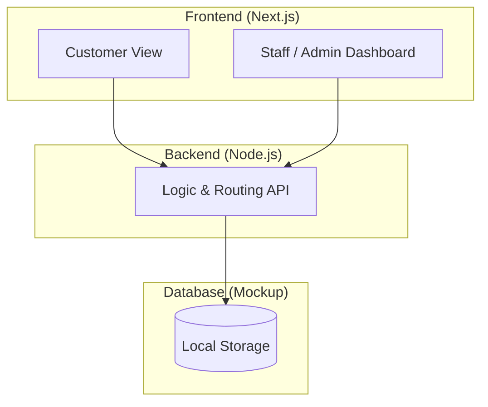
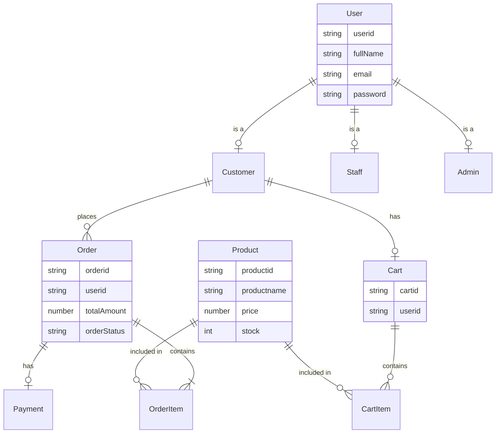

# เอกสาร Analysis & Design

## สารบัญ (Table of Contents)
- [1. ภาพรวมระบบ (System Overview)](#1-ภาพรวมระบบ-system-overview)
- [2. ความต้องการของระบบ (Requirement Analysis)](#2-ความต้องการของระบบ-requirement-analysis)
 - [2.1 Functional Requirements](#21-functional-requirements)
 - [2.2 Non-Functional Requirements (SLA Targets)](#22-non-functional-requirements-sla-targets)
 - [2.3 Use Case Diagram](#23-use-case-diagram)
- [3. การจำลองกลุ่มผู้ใช้งาน (Persona Design)](#3-การจำลองกลุ่มผู้ใช้งาน-persona-design)
- [4. สถาปัตยกรรมระบบ (System Architecture)](#4-สถาปัตยกรรมระบบ-system-architecture)
- [5. โครงสร้างฐานข้อมูล (Database Design)](#5-โครงสร้างฐานข้อมูล-database-design)
 - [5.1 Data Schema (LocalStorage JSON)](#51-data-schema-localstorage-json)
 - [5.2 Class Diagram](#52-class-diagram)
 - [5.3 Mermaid ER Diagram](#53-mermaid-er-diagram)
- [6. Flow การทำงานหลัก (Sequence)](#6-flow-การทำงานหลัก-sequence)
 - [6.1 Sequence Diagram](#61-sequence-diagram)
- [7. หลักการออกแบบที่นำมาใช้ (Design Principles)](#7-หลักการออกแบบที่นำมาใช้-design-principles)

---

## 1. ภาพรวมระบบ (System Overview)

ระบบ Re-wear เป็นแพลตฟอร์ม e-Commerce สำหรับส่งต่อเสื้อผ้ามือสอง โดยมีผู้ใช้งานหลัก 3 กลุ่มคือ
ลูกค้า (Customer), พนักงาน (Staff) และ ผู้ดูแลระบบ (Administrator)

---

## 2. ความต้องการของระบบ (Requirement Analysis)

### 2.1 Functional Requirements

| รหัส | รายการ | รายละเอียด | ความสำคัญ |
|---|---|---|---|
| F-01 | สมัครสมาชิก | ลูกค้าสามารถสมัครสมาชิกเพื่อเข้าใช้งาน | High |
| F-02 | ค้นหาและดูสินค้า | ลูกค้าสามารถค้นหาและดูรายละเอียดเสื้อผ้า | High |
| F-03 | จัดการตะกร้าสินค้า | ลูกค้าสามารถเพิ่ม แก้ไข ลบสินค้าในตะกร้า | High |
| F-04 | สั่งซื้อและชำระเงิน | ลูกค้าสามารถสั่งซื้อ ติดตามสถานะ และดูประวัติ | High |
| F-05 | จัดการสต็อกสินค้า | พนักงานสามารถเพิ่ม แก้ไข ลบ และตรวจสอบสินค้า | High |
| F-06 | จัดการคำสั่งซื้อ | พนักงานสามารถตรวจสอบและเปลี่ยนสถานะคำสั่งซื้อ | High |
| F-07 | Dashboard ผู้ดูแล | ผู้ดูแลระบบสามารถดูภาพรวมและรายงานระบบ | Medium |
| F-08 | จัดการผู้ใช้งาน | ผู้ดูแลระบบสามารถจัดการข้อมูลสมาชิกและสิทธิ์พนักงาน | High |

### 2.2 Non-Functional Requirements (SLA Targets)

- **Availability**: ความพร้อมใช้งานระบบ 99.5%
- **Backup**: สำรองข้อมูลใน Local Storage
- **Support Hours**: จันทร์ - ศุกร์ เวลา 08:30 - 17:30 น.
- **Incident Response**: การตอบสนองและแก้ไขปัญหาตามระดับ Severity (1-3)

### 2.3 Use Case Diagram


---

## 3. การจำลองกลุ่มผู้ใช้งาน (Persona Design)

### 3.1 Persona 1: Customer (ลูกค้า)
- **ชื่อ:** ฟ้าใส สายรักษ์โลก (อายุ 22 ปี, นักศึกษา)
- **Bio:** ชื่นชอบการแต่งตัวและแฟชั่นวินเทจ ใส่ใจสิ่งแวดล้อม ชอบซื้อเสื้อผ้ามือสองเพราะราคาถูกและมีสไตล์ไม่ซ้ำใคร
- **Goals:** ต้องการแพลตฟอร์มที่ค้นหาเสื้อผ้ามือสองสภาพดีได้ง่าย, ขั้นตอนสั่งซื้อไม่ซับซ้อน, ติดตามสถานะของได้
- **Pain Points:** ร้านทั่วไปรายละเอียดสินค้าไม่ชัดเจน, สั่งซื้อยุ่งยาก
- **Scenario:** ฟ้าใสเข้ามาหาเสื้อแจ็คเก็ตมือสอง ค้นหาเจอ หยิบลงตะกร้า สั่งซื้อ ชำระเงิน และติดตามสถานะ

### 3.2 Persona 2: Staff (พนักงาน)
- **ชื่อ:** ก้องเกียรติ ขยันทำงาน (อายุ 26 ปี, พนักงานดูแลร้าน)
- **Bio:** รับหน้าที่จัดการออเดอร์ อัปเดตสต็อก และดูแลความเรียบร้อยของสินค้า
- **Goals:** อัปเดตสถานะสินค้าและคำสั่งซื้อได้อย่างรวดเร็ว, ตรวจสอบการชำระเงินได้ง่าย
- **Pain Points:** ระบบจัดการออเดอร์หลายขั้นตอนทำให้ล่าช้า
- **Scenario:** ก้องเกียรติล็อกอินเข้าระบบ ตรวจสอบคำสั่งซื้อใหม่ ยืนยันการชำระเงิน และอัปเดตสถานะจัดส่ง

### 3.3 Persona 3: Administrator (ผู้ดูแลระบบ)
- **ชื่อ:** วีระ ผู้จัดการ (อายุ 34 ปี, ผู้ดูแลระบบ)
- **Bio:** ต้องการให้ระบบทำงานเสถียรและติดตามยอดขายได้
- **Goals:** ดูภาพรวมของระบบผ่าน Dashboard, จัดการสิทธิ์พนักงาน
- **Pain Points:** ขาดสรุปข้อมูลยอดขายที่ดูง่าย
- **Scenario:** วีระเข้าสู่ Dashboard ดูสถิติยอดขาย จัดการสิทธิ์การเข้าถึงของ Staff

---

## 4. สถาปัตยกรรมระบบ (System Architecture)

ระบบออกแบบตามแนวคิดที่เน้นการพัฒนาได้อย่างรวดเร็ว
แบ่งออกเป็น Frontend (Next.js), Backend (Node.js) และฐานข้อมูลชั่วคราว (Local Storage)



### 4.1 Frontend Architecture (ส่วนที่ผู้ใช้งานโต้ตอบกับระบบ)
- **การนำเสนอหน้าเว็บ**: แสดงผลเว็บแอปพลิเคชันรองรับการทำงานของ Customer, Staff และ Admin
- **ฟังก์ชันหลัก**: ระบบสมัครสมาชิก / Login, แสดงสินค้าเสื้อผ้ามือสอง, จัดการตะกร้าสินค้า (Cart), ดำเนินการสั่งซื้อ (Mockup) และหน้าแดชบอร์ดจัดการระบบ
- **รูปแบบสถาปัตยกรรม**: Component-Based Architecture / Single Page Application (SPA)
- **เทคโนโลยีหลัก**: Next.js (React Framework)
- **สิ่งที่พิจารณาเป็นพิเศษ**: 
 - *UX/UI*: รองรับ Responsive Design และ Mobile First เนื่องจากผู้ซื้อเสื้อผ้าส่วนใหญ่ใช้งานผ่านโทรศัพท์มือถือ
 - *Security*: ป้องกันการดึงข้อมูลส่วนตัว และใช้ JWT / Cookies ในการเก็บเซสชัน
 - *Scalability*: เตรียมความพร้อมใช้งาน CDN และ Caching ในการโหลดรูปภาพสินค้าที่มีจำนวนมาก

### 4.2 Backend Architecture (ส่วนประมวลผลหลักของระบบ)
- **การจัดการ Business Logic**: การคำนวณยอดชำระ, อัปเดตสถานะการจองสต็อกสินค้า (เนื่องจากเสื้อผ้ามือสองมีเพียง 1 ชิ้นต่อชิ้น), ตรวจสอบสิทธิ์การทำงาน
- **ฟังก์ชันหลัก**: จัดการบัญชีผู้ใช้ (Auth Service), จัดการรายการสินค้า (Product Service), จัดการการซื้อขาย (Order Service), และการตรวจสอบชำระเงิน (Payment Service)
- **รูปแบบสถาปัตยกรรม**: Monolithic Architecture ในเฟสเริ่มต้น เพื่อความรวดเร็วในการพัฒนาต้นแบบและมีความคล่องตัวสูง
- **เทคโนโลยีหลัก**: Node.js + Express
- **สิ่งที่พิจารณาเป็นพิเศษ**:
 - *API Architecture*: ออกแบบในรูปแบบ REST API เพื่อรับส่งข้อมูล JSON ระหว่างหน้าเว็บและเซิร์ฟเวอร์
 - *DevOps*: ใช้ GitHub Actions ทำระบบ CI/CD และควบคุมเวอร์ชันผ่าน Git / GitHub

### 4.3 Database Architecture (ระบบจัดเก็บข้อมูล)
- **การจัดการข้อมูล**: เก็บข้อมูลผู้ใช้ (Users), สินค้าเสื้อผ้ามือสอง (Products), คำสั่งซื้อ (Orders), และประวัติการทำรายการ (Payments)
- **รูปแบบสถาปัตยกรรม**: จำลองรูปแบบฐานข้อมูลด้วย Local Storage โดยเซฟในรูปแบบ JSON Object เพื่อให้รองรับการพัฒนารวดเร็ว (Rapid Prototyping)
- **เทคโนโลยีหลัก**: Local Storage (และเตรียมย้ายไปใช้ Relational Database เช่น MySQL/PostgreSQL ในการผลิตจริง)
- **สิ่งที่พิจารณาเป็นพิเศษ**:
 - *Database Design*: ทำ Normalization เพื่อลดความซ้ำซ้อนของข้อมูล และออกแบบ Backup & Recovery เผื่อกรณีข้อมูลในเครื่องผู้ใช้สูญหาย

---

## 5. โครงสร้างฐานข้อมูล (Database Design)

### 5.1 Data Schema (LocalStorage JSON)

ระบบจัดเก็บข้อมูลใน LocalStorage เพื่อใช้เป็นตัวอย่างสาธิต โดยมีโครงสร้างดังนี้:

```json
{
 "users": [
 { "id": "U01", "role": "customer", "name": "ฟ้าใส", "email": "fah@email.com" },
 { "id": "S01", "role": "staff", "name": "ก้องเกียรติ", "email": "staff@email.com" }
 ],
 "products": [
 { "id": "P01", "name": "Vintage Denim Jacket", "price": 450, "stock": 1, "status": "Available" }
 ],
 "orders": [
 { "id": "O01", "customerId": "U01", "status": "Pending", "totalAmount": 450 }
 ]
}
```

### 5.2 Class Diagram


### 5.3 Mermaid ER Diagram


---

## 6. Flow การทำงานหลัก (Sequence)

### 6.1 Sequence Diagram


---

## 7. หลักการออกแบบที่นำมาใช้ (Design Principles)

ตามที่ได้ศึกษาในวิชา CSI204 ระบบ Re-wear ได้นำหลักการออกแบบสถาปัตยกรรมซอฟต์แวร์ (Software Architecture Design Principles) มาประยุกต์ใช้งานดังนี้:

- **3.1 Separation of Concerns (SoC)**: แยกส่วนของระบบออกเป็นเลเยอร์อย่างชัดเจน ได้แก่ Frontend (แสดงผล UI ด้วย Next.js), Backend (ประมวลผลคำขอด้วย Node.js) และ Database (จัดเก็บข้อมูล) ช่วยให้ง่ายต่อการดูแลรักษา
- **3.2 Single Responsibility Principle (SRP)**: ออกแบบคลาสและฟังก์ชันให้มีหน้าที่รับผิดชอบเพียงอย่างเดียว เช่น แยกคลาสจัดการบัญชีผู้ใช้งาน (User Module) ออกจากโมดูลระบบสินค้า (Product Module) และระบบสั่งซื้อ (Order Module)
- **3.3 Modularity**: การแบ่งระบบเป็นโมดูลย่อยที่มีอิสระต่อกัน (เช่น User Service, Product Service, Order Service) ช่วยให้ทีมพัฒนาสามารถทดสอบ ปรับปรุง และแก้ไขโค้ดในส่วนอื่นได้โดยไม่กระทบต่อระบบรวมทั้งหมด
- **3.4 Loose Coupling**: ลดการยึดติดกันระหว่างโมดูล โดยให้ Frontend และ Backend สื่อสารกันผ่าน REST API แทนการเชื่อมต่อตรง ทำให้สามารถปรับปรุงระบบหลังบ้านหรือสลับไปใช้ฐานข้อมูลระบบอื่นได้ง่ายขึ้นในอนาคต
- **3.5 High Cohesion**: จัดกลุ่มของโค้ดและข้อมูลที่มีความสัมพันธ์ใกล้ชิดกันให้อยู่ในโมดูลเดียวกัน เช่น จัดการโครงสร้างโฟลเดอร์สำหรับเอกสารวิเคราะห์ระบบให้อยู่ภายใต้โฟลเดอร์ `docs/` ทั้งหมด และหน้าหลังบ้านของแอดมินไว้ใน Dashboard ส่วนกลาง
- **3.6 Scalability**: วางสถาปัตยกรรมระบบให้พร้อมรองรับการเติบโตของผู้ใช้และการขยายทรัพยากร ทั้งในระดับแนวตั้ง (Vertical: อัปเกรดเครื่องเซิร์ฟเวอร์) และแนวราบ (Horizontal: การใช้ Load Balancer และการแยก Service ในอนาคตหากฐานผู้ซื้อเติบโต)
- **3.7 Reusability**: เขียนโค้ดให้สามารถนำกลับมาใช้ซ้ำได้ เช่น การทำ Utility Functions สำหรับจัดรูปแบบราคา (บาท), ฟังก์ชันแปลงวันที่ และการนำ Component ต่าง ๆ เช่น การ์ดรายการสินค้า และปุ่มกดกลับมาเรียกใช้ในหลายหน้าเว็บ
- **3.8 Security**: ออกแบบระบบความปลอดภัยตั้งแต่ขั้นตอนเริ่มต้น (Secure by Design) มีมาตรการจำกัดสิทธิ์การเข้าถึงข้อมูลตามบทบาทผู้ใช้ (Authentication/Authorization) และวางแผนเข้ารหัสผ่านผู้ใช้
- **3.9 Flexibility**: สถาปัตยกรรมสามารถปรับเปลี่ยนหรือเพิ่มฟีเจอร์ใหม่ได้ยืดหยุ่น เช่น การเปลี่ยนจาก Monolithic ไปสู่ Microservices ในระยะยาว หรือการเพิ่มช่องทางชำระเงินใหม่ๆ (เช่น พร้อมเพย์, บัตรเครดิต) เข้าไปในระบบโดยง่าย

---

## 8. สรุป (Conclusion)

ระบบ **Re-wear** ได้รับการออกแบบและพัฒนาขึ้นโดยมีแนวคิดหลักด้านความยั่งยืน (Circular Fashion) เป็นจุดศูนย์กลาง ผ่านกระบวนการวิเคราะห์และออกแบบที่ครอบคลุมตั้งแต่การกำหนดความต้องการ การออกแบบสถาปัตยกรรม ไปจนถึงการพัฒนาต้นแบบ (Prototype) ที่ใช้งานได้จริง

### ผลลัพธ์ที่ได้จากโครงการ

| ด้าน | ผลลัพธ์ |
|---|---|
| **Functional Requirements** | ครบ 8 รายการ (F-01 ถึง F-08) |
| **จำนวนหน้าที่พัฒนา** | 14 หน้า (Customer: 8 หน้า, Admin Panel: 6 หน้า) |
| **Role-based System** | จัดการสิทธิ์ 3 บทบาทผ่าน AuthContext และ Route Protection (`useAdminGuard`) |
| **Design Principles** | นำมาประยุกต์ใช้ 9 หลักการ (SoC, SRP, Modularity, Loose Coupling ฯลฯ) |
| **เทคโนโลยีหลัก** | Next.js 15 (App Router), Tailwind CSS, Lucide React, Recharts |

### ข้อจำกัดและแนวทางพัฒนาต่อในอนาคต

- **ระบบยืนยันตัวตน (Authentication):** ปัจจุบันจำลองการ Login และเก็บสิทธิ์ผ่าน `localStorage` (Mock Auth) แนวทางต่อไปคือนำ JWT / NextAuth.js มาใช้งานจริง
- **ฐานข้อมูล:** ข้อมูลสินค้าและออเดอร์จัดเก็บผ่าน Mock Data และ `localStorage` แนวทางต่อไปคือเชื่อมต่อกับ Backend API และ Database จริง เช่น PostgreSQL
- **ระบบชำระเงิน:** ปัจจุบันเป็นแบบ Mockup แนวทางต่อไปคือผนวกกับ Payment Gateway เช่น Stripe หรือ Omise

> **Note:** เอกสารนี้แสดงการวิเคราะห์และออกแบบระบบเบื้องต้น ซึ่งจะถูกนำไปใช้เป็นแนวทางในการพัฒนาระบบจริงในขั้นตอนถัดไป สร้างด้วย ️ โดย **กลุ่ม Re-wear** สำหรับวิชา CSI204
